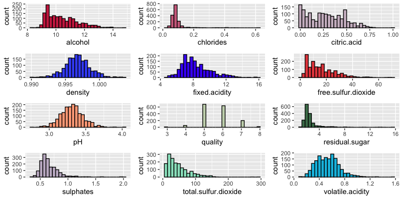
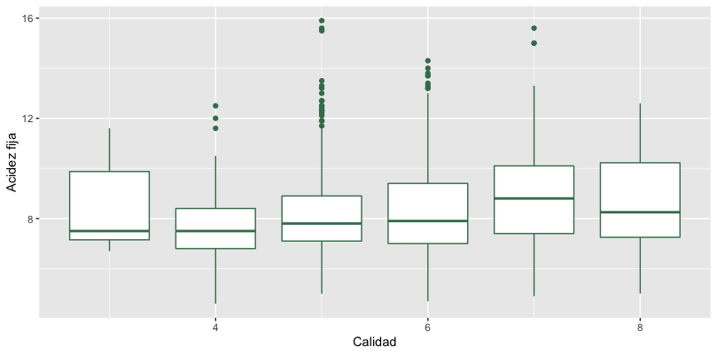
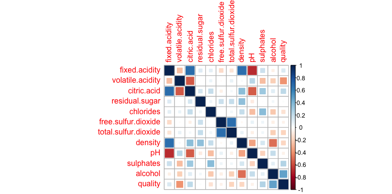
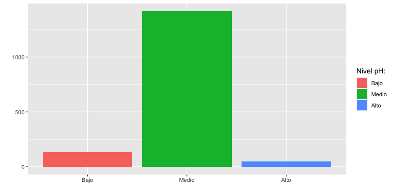

```{r warning=FALSE, include=F, paged.print=TRUE}
suppressMessages(library(dplyr))
suppressMessages(library(readxl))
suppressMessages(library(tidyverse))
suppressMessages(library(FactoMineR))
suppressMessages(library(factoextra))
suppressMessages(library(foreign))
suppressMessages(library(corrplot))
suppressMessages(library(polycor))
suppressMessages(library(psych))
suppressMessages(library(gplots))
suppressMessages(library(gridExtra))
suppressMessages(library(viridis))
suppressMessages(library(lsr))
suppressMessages(library(DescTools))
suppressMessages(library(magrittr))
suppressMessages(library(nlme))
suppressMessages(library(MASS))
suppressMessages(library(multilevel))
suppressMessages(library(plspm))
suppressMessages(library(reshape))
suppressMessages(library(homals))
suppressMessages(library(GGally))
suppressMessages(library(CCA))
suppressMessages(library(plotly))
suppressMessages(library(broom))
suppressMessages(library(readr))
suppressMessages(library(readxl))
```

# Actividad 1

## 

# Actividad 2

## Base de datos 

```{r warning=FALSE, include=F, paged.print=TRUE}
Datos <- read.table("Datos.txt",header=T,sep = ",")
Datos
```

Este conjunto de datos de vino tinto consta de 1599 observaciones y 12 variables, 11 de las cuales son sustancias químicas. Las variables son:

<div style="text-align: justify">

1. **Acidez fija:** La mayoría de los ácidos implicados en el vino son fijos o no volátiles (no se evaporan fácilmente).

2. **Acidez volátil:** La cantidad de ácido acético en el vino, que en niveles demasiado altos puede provocar un sabor desagradable a vinagre.

3. **Ácido cítrico:** Encontrado en pequeñas cantidades, el ácido cítrico puede agregar "frescura" y sabor a los vinos.

4. **Azúcar residual:** Es la cantidad de azúcar que queda después de que se detiene la fermentación, es raro encontrar vinos con menos de 1 gramo / litro y los vinos con más de 45 gramos / litro se consideran dulces.

5. **Cloruros:** Es la cantidad de sal del vino.

6. **Dióxido de azufre libre:** La forma libre de $SO_{2}$ existe en equilibrio entre el $SO_{2}$ molecular (como gas disuelto) y el ion bisulfito; Previene el crecimiento microbiano y la oxidación del vino.

7. **Dióxido de azufre total:** Es la cantidad de formas libres y unidas de $SO_{2}$; en concentraciones bajas, el $SO_{2}$ es mayormente indetectable en el vino, pero en concentraciones de $SO_{2}$ libre superiores a 50 ppm, el $SO_{2}$ se hace evidente en la nariz y el sabor del vino.

8. **Densidad:** La densidad es cercana a la del agua dependiendo del porcentaje de alcohol y contenido de azúcar.

9. **pH:** Describe qué tan ácido o básico es un vino en una escala de 0 (muy ácido) a 14 (muy básico); la mayoría de los vinos están entre 3-4 en la escala de pH.

10 **Sulfatos:** Aditivo del vino que puede contribuir a los niveles de dióxido de azufre $(SO_{2})$, que actúa como antimicrobiano y antioxidante.

11 **Alcohol:** El porcentaje de contenido de alcohol del vino.

12. **Calidad:** Variable de respuesta (basada en datos sensoriales, puntuación entre 0 y 10).

<div/>


```{r warning=FALSE, include=T, paged.print=TRUE}
dim(Datos)
```

## Estadísticas descriptivas

```{r warning=FALSE, include=T, paged.print=TRUE}
summary(Datos)
```

<center>
{width=650px}

<center>
{width=500px}

<center>
{width=650px}


## Variable indicadora: pHi 

```{r warning=FALSE, include=F, paged.print=TRUE}
summary(Datos[,"pH"])
pHi <- cut(Datos$pH, breaks = c(2.6,3.1,3.6,4.1), labels = c("Bajo", "Medio", "Alto"))
head(pHi)
```

```{r warning=FALSE, include=T, paged.print=TRUE}
table(pHi)

```

<center>
{width=500px}

## Modelo lineal generalizado (GLM)

```{r warning=FALSE, include=T, paged.print=TRUE}
Modelo <- glm(Datos$quality ~ Datos$fixed.acidity + pHi, data=Datos)
summary(Modelo)

```


# Conlusiones

# Biblíografia 